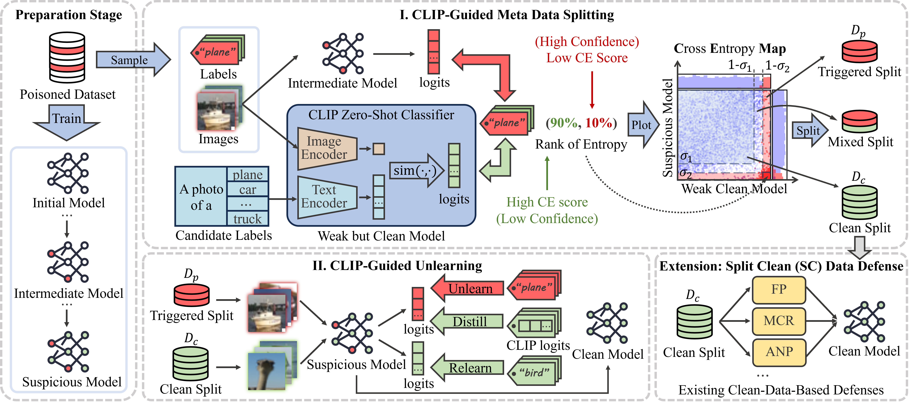

# CLIP-Guided Backdoor Defense via Entropy-Based Data Separation (CGD)



## Abstract

Deep Neural Networks (DNNs) are susceptible to backdoor attacks, where adversaries poison training data to implant backdoors into the victim model. Current backdoor defenses on poisoned data often suffer from high computational costs or low effectiveness against advanced attacks like clean-label and clean-image backdoors. To address these challenges, we introduce **CLIP-Guided Backdoor Defense (CGD)**, an efficient and effective method that mitigates various backdoor attacks.

CGD utilizes a publicly accessible CLIP model to identify inputs that are likely to be clean or poisoned. It then retrains the model with these inputs, using CLIP’s logits as guidance to effectively neutralize the backdoor. Experiments on four datasets and eleven attack types demonstrate that CGD reduces attack success rates (ASRs) to below 1% while maintaining clean accuracy (CA) with a maximum drop of only 0.3%, outperforming existing defenses. Additionally, we show that clean-data-based defenses can be adapted to poisoned data using CGD. CGD also exhibits strong robustness, maintaining low ASRs even when employing a weaker CLIP model or when CLIP itself is compromised by a backdoor. These findings underscore CGD’s exceptional efficiency, effectiveness, and applicability for real-world backdoor defense scenarios.

---

## Table of Contents

- [Introduction](#introduction)
- [Prerequisites](#prerequisites)
- [Installation](#installation)
- [Quick Start](#quick-start)
- [Step-by-Step Guide](#step-by-step-guide)
  - [Step 1: CLIP-Guided Meta Data Splitting](#step-1-clip-guided-meta-data-splitting)
  - [Step 2: CLIP-Guided Unlearning](#step-2-clip-guided-unlearning)
- [Key Parameters](#key-parameters)
- [Applying CGD to Other Defenses](#applying-cgd-to-other-defenses)
- [Code Structure](#code-structure)
- [Citation](#citation)

---

## Prerequisites

- Python 3.10 or higher
- CUDA-compatible GPU
- PyTorch 2.0 or higher
- [BackdoorBench](https://github.com/SCLBD/BackdoorBench) (for benchmarking backdoor attacks and defenses)

## Installation

1. **Clone the Repository**

   ```bash
   git clone https://github.com/yourusername/CGD.git
   cd CGD
   ```

2. **Install Required Packages**

   Install the required Python packages using `pip`:

   ```bash
   pip install -r requirements.txt
   ```

   *Note:* Ensure that PyTorch is installed with CUDA support.

3. **Set Up BackdoorBench**

   Follow the instructions in the [BackdoorBench repository](https://github.com/SCLBD/BackdoorBench) to set it up in your environment.

## Quick Start

To get started quickly, you can run a predefined attack and defense scenario using the provided scripts. Ensure that you have set the correct paths in the scripts before running them.

## Step-by-Step Guide

### Step 1: CLIP-Guided Meta Data Splitting

First, you need to run a backdoor attack using BackdoorBench. After generating the poisoned dataset, you can use CGD to split the data based on entropy computed using CLIP.

1. **Modify `main.py`**

   Replace the placeholders `Your_Custom_BackdoorBench_Path` and `Your_Custom_Attack_Path` in `main.py` with your actual paths:

   ```python
   backdoorbench_path = 'Your_Custom_BackdoorBench_Path'
   attack_path = 'Your_Custom_Attack_Path'
   ```

2. **Run `main.py`**

   Execute the script to generate and visualize the entropy map and to split the clean data:

   ```bash
   python main.py
   ```

3. **Generated Files**

   After running the script, several files will be generated in the `AWC` directory:

   - `clean_indices.json`: Indices of the clean samples filtered by CGD (resampled to balance classes).
   - `entropy_score.json`: Coordinates for the entropy map.
   - `logits.pt`: Raw logits information from CLIP.
   - `vslz_with_histograms_colored.png`: Visualization of the entropy map.

### Step 2: CLIP-Guided Unlearning

Next, you will perform the unlearning step to neutralize the backdoor.

1. **Copy CGD Defense Code**

   Copy the `cgd.py` script and the `cgd` configuration directory to your BackdoorBench defense directory:

   ```bash
   cp ./4backdoorbench/cgd.py Your_Custom_BackdoorBench_Path/BackdoorBench/defense/
   cp -r ./4backdoorbench/cgd Your_Custom_BackdoorBench_Path/BackdoorBench/config/defense/
   ```

2. **Run the Defense**

   Execute the defense script with the appropriate arguments:

   ```bash
   CUDA_VISIBLE_DEVICES=0 python "defense/cgd.py" \
       --result_file "badnet" \
       --yaml_path "./config/defense/cgd/cifar10.yaml" \
       --dataset cifar10 \
       --dataset_path "./data"
   ```

   *Note:* Adjust `CUDA_VISIBLE_DEVICES`, `result_file`, `yaml_path`, `dataset`, and `dataset_path` as needed.

## Key Parameters

The CGD method has several key parameters that you can adjust in the configuration file (`.yaml`):

- **`alpha`**: Weight for KL divergence loss during distillation. Default: `0.0005`.
- **`beta`**: Weight for negative cross-entropy loss during unlearning. Default: `0.025`.
- **`sigma1`**: Threshold for selecting the clean subset. Default: `0.2`.
- **`sigma2`**: Threshold for selecting the triggered subset. Default: `0.1`.
- **`tolerance`**: Tolerance for early stopping based on clean accuracy drop. Default: `1.0`.
- **`epochs`**: Number of epochs for normal training. Default: `10`.

*Tip:* If you find that the Attack Success Rate (ASR) is not reduced enough, you can increase the `tolerance` and `epochs` parameters.

## Applying CGD to Other Defenses

CGD can be integrated with other defenses in BackdoorBench. We provide examples in the `./4backdoorbench/other_defenses` directory.

1. **Modify Other Defenses**

   Copy the modified defense scripts from `./4backdoorbench/other_defenses` to your BackdoorBench defense directory.

2. **Enable CLIP Splitting**

   An additional parameter `--enable_clip` is added to indicate whether to use the clean subset separated by CGD or directly use a real clean dataset (typically 5%).

   Example:

   ```bash
   CUDA_VISIBLE_DEVICES=0 python "defense/other_defense.py" \
       --enable_clip \
       --result_file "badnet" \
       --yaml_path "./config/defense/other_defense/cifar10.yaml" \
       --dataset cifar10 \
       --dataset_path "./data"
   ```

## Code Structure

```
CGD
├── assets
│   └── pipeline.png
├── utils
│   ├── dataset
│   ├── data.py
│   ├── models.py
│   ├── preact_resnet.py
│   ├── pretrained_classifier.py
│   └── visualization.py
├── main.py
├── requirements.txt
├── readme.md
└── 4backdoorbench
    ├── cgd.py
    ├── cgd
    └── other_defenses
```

- **`assets/pipeline.png`**: Diagram illustrating the CGD pipeline.
- **`utils/`**: Utility functions and classes for data handling, models, and visualization.
- **`main.py`**: Main script for CLIP-guided data splitting.
- **`requirements.txt`**: Python package requirements.
- **`4backdoorbench/`**: Integration code for BackdoorBench.
  - **`cgd.py`**: CGD defense script.
  - **`cgd/`**: Configuration files for CGD defense.
  - **`other_defenses/`**: Modified defense scripts to work with CGD.

## Citation

If you find this work useful in your research, please consider citing:

```bibtex
@inproceedings{xxx,
  title={CLIP-Guided Backdoor Defense via Entropy-Based Data Separation},
  author={xxx},
  booktitle={xxx},
  year={2025}
}
```

---

For any questions or issues, please open an issue in this repository or contact us at [xxx@xxx.com](mailto:xxx@xxx.com).

Thank you for your interest in our work!